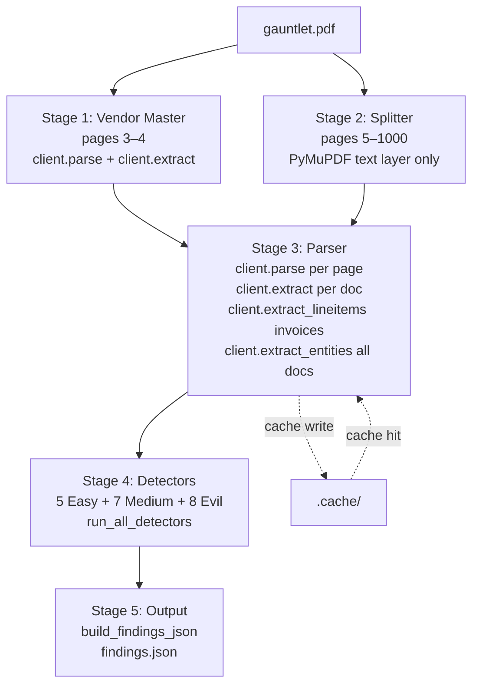
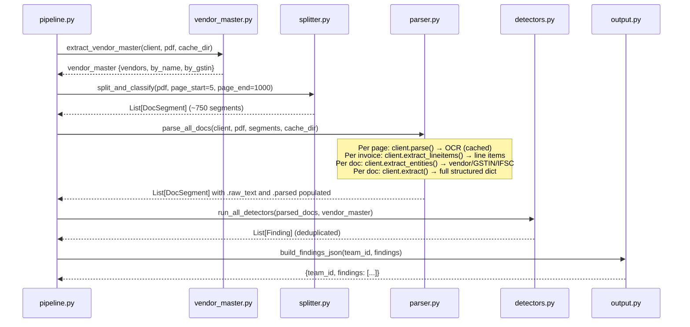

# Design Document: Financial Error Detection Pipeline

## Overview

An AI-powered 5-stage pipeline that processes `gauntlet.pdf` — a 1,000-page Accounts Payable bundle for HyperAPI Technologies Pvt Ltd (FY 2025–2026) — and produces a `findings.json` file enumerating up to 200 deliberate financial errors ("needles") across 20 categories. The pipeline uses PyMuPDF for fast document splitting and the HyperAPI SDK for OCR and structured extraction, with a disk-based cache to avoid redundant API calls across runs.

The design addresses three known gaps in the existing skeleton: (1) a broken `stages/` import path that must be flattened to `logic/`, (2) four missing Evil-tier detector implementations, and (3) a missing `run_all_detectors()` orchestrator. It also specifies parallelization, deduplication, and API-usage strategy to maximize needle recall while keeping false positives below the −0.5 penalty threshold.

---

## Architecture




## Data Flow Between Stages



---

## Module Structure (Corrected — Flat `logic/` Layout)

The existing skeleton uses `from stages.vendor_master import ...` throughout, but all files live at `logic/*.py` with no `stages/` subdirectory. Every import must be corrected to use relative or direct module imports.

```
logic/
├── __init__.py          ← ADD: makes logic/ a package
├── pipeline.py          ← FIX: from logic.vendor_master import ...
├── vendor_master.py     ← no change needed
├── splitter.py          ← no change needed
├── parser.py            ← FIX: from logic.splitter import DocSegment
├── detectors.py         ← FIX: from logic.splitter import DocSegment
└── output.py            ← no change needed
requirements.txt         ← ADD at repo root
```

The pipeline is invoked from the repo root as `python -m logic.pipeline` (or `python logic/pipeline.py` after fixing sys.path). The corrected import pattern in every file:

```python
# Before (broken):
from stages.splitter import DocSegment

# After (correct):
from logic.splitter import DocSegment
# OR, when running as __main__ from inside logic/:
from splitter import DocSegment
```

The cleanest fix is to add `logic/__init__.py` and run `python -m logic.pipeline` from the repo root, using `from logic.X import Y` everywhere.

---

## Core Data Models

### DocSegment

```python
@dataclass
class DocSegment:
    doc_type:  str               # "invoice" | "po" | "bank_statement" |
                                 # "expense_report" | "credit_note" |
                                 # "debit_note" | "receipt" | "other"
    pages:     List[int]         # 1-indexed page numbers in gauntlet.pdf
    doc_id:    Optional[str]     # e.g. "INV-2025-0042", "PO-2025-0017"
    raw_text:  str               # concatenated OCR text (filled by parser)
    parsed:    dict              # structured extraction result (filled by parser)
```

`parsed` dict shape after Stage 3 (union of all API responses):

```python
{
    # From client.extract()
    "invoice_number":   str | None,
    "po_number":        str | None,
    "invoice_date":     str | None,   # raw string, e.g. "31/02/2025"
    "due_date":         str | None,
    "vendor_name":      str | None,
    "subtotal":         float | str | None,
    "tax_amount":       float | str | None,
    "total":            float | str | None,
    "line_items":       List[LineItem],
    "validation_errors": List[ValidationError],

    # From client.extract_lineitems()  — merged into parsed
    # (overwrites line_items with validated version)

    # From client.extract_entities()  — merged into parsed
    "gstin":            str | None,
    "vendor_gstin":     str | None,
    "bank_ifsc":        str | None,
    "employee_id":      str | None,
    "employee_name":    str | None,
    "opening_balance":  float | str | None,
    "closing_balance":  float | str | None,
    "statement_date":   str | None,
    "transactions":     List[Transaction],
}
```

### LineItem

```python
{
    "description":  str,
    "quantity":     float | str,
    "rate":         float | str,    # also "unit_price"
    "amount":       float | str,    # also "line_total"
    "hsn":          str | None,     # also "sac", "hsn_sac"
    "tax_rate":     float | None,   # also "gst_rate"
    "date":         str | None,     # for expense line items
    "activity":     str | None,     # for time-billing lines
}
```

### Vendor Master

```python
{
    "vendors": {
        "V001": {
            "name":         str,
            "gstin":        str,   # 15-char GST number
            "state_code":   str,   # first 2 digits of GSTIN
            "state":        str,
            "ifsc":         str,
            "bank_account": str,
            "address":      str,
            "source_page":  int,
        },
        ...  # 35 vendors total
    },
    "by_name":  { "vendor name lowercase": "V001", ... },
    "by_gstin": { "29AABCA1234F1Z5": "V001", ... },
}
```

### Finding (submission schema)

```python
{
    "finding_id":     str,    # "F-001", "F-002", ... (assigned by output.py)
    "category":       str,    # one of 20 valid categories
    "pages":          List[int],
    "document_refs":  List[str],
    "description":    str,
    "reported_value": str,
    "correct_value":  str,
}
```

---

## Stage 3: Parser — API Usage Strategy

The parser must call three HyperAPI endpoints per document to maximize extraction quality. The strategy avoids redundant calls and uses the most targeted endpoint for each data type.

```
Per page (all doc types):
  client.parse(img_path)          → OCR text
  Cache key: ocr_{page_no:04d}.json

Per invoice document:
  client.extract_lineitems(ocr)   → validated line items (qty×rate, billing_typo)
  client.extract_entities(ocr)    → vendor, GSTIN, IFSC, dates
  client.extract(ocr)             → full structured dict (fallback + totals)
  Cache key: extract_{hash}.json, lineitems_{hash}.json, entities_{hash}.json

Per non-invoice document:
  client.extract_entities(ocr)    → vendor, dates, employee_id, balances
  client.extract(ocr)             → full structured dict
  Cache key: extract_{hash}.json, entities_{hash}.json
```

Merge order (later overwrites earlier for same key):

```
parsed = {}
parsed.update(client.extract(ocr)["data"])
parsed.update(client.extract_entities(ocr)["data"])
if doc_type == "invoice":
    li_data = client.extract_lineitems(ocr)["data"]
    parsed["line_items"] = li_data.get("line_items", parsed.get("line_items", []))
```

`extract_lineitems` is preferred over `extract` for line items on invoices because it applies HyperAPI's internal arithmetic validation and billing-typo detection, surfacing `validation_errors` with `type="billing_typo"` or `type="arithmetic"`.

---

## Parallelization Strategy

Stage 3 is the bottleneck (~750 documents × 3 API calls = ~2,250 calls). Use `concurrent.futures.ThreadPoolExecutor` with a semaphore for rate limiting.

```python
from concurrent.futures import ThreadPoolExecutor, as_completed
import threading

_API_SEMAPHORE = threading.Semaphore(8)   # max 8 concurrent API calls

def _parse_one(client, pdf_doc, seg, cache_dir):
    with _API_SEMAPHORE:
        seg.raw_text = _parse_pages(client, pdf_doc, seg.pages, cache_dir)
        key_str  = f"{seg.doc_id}|{seg.pages}"
        doc_hash = hashlib.md5(key_str.encode()).hexdigest()
        seg.parsed = _extract_all(client, seg.raw_text, seg.doc_type, doc_hash, cache_dir)
    return seg

def parse_all_docs(client, pdf_path, segments, cache_dir):
    pdf_doc = fitz.open(str(pdf_path))
    with ThreadPoolExecutor(max_workers=8) as pool:
        futures = {pool.submit(_parse_one, client, pdf_doc, seg, cache_dir): seg
                   for seg in segments}
        for fut in as_completed(futures):
            fut.result()   # re-raises exceptions
    pdf_doc.close()
    return segments
```

Note: `fitz.Document` is not thread-safe for rendering. Each thread must open its own `fitz.open()` handle, or page rendering must be serialized with a lock. The recommended approach is to pre-render all pages to `/tmp/page_NNNN.png` in a single-threaded pass before launching the thread pool for API calls.

---

## Caching Strategy

```
.cache/
├── vendor_master_<hash>.json       Stage 1 — full vendor_master dict
├── ocr_{page_no:04d}.json          Stage 3 — raw OCR per page
├── extract_{doc_hash}.json         Stage 3 — client.extract() result
├── lineitems_{doc_hash}.json       Stage 3 — client.extract_lineitems() result
├── entities_{doc_hash}.json        Stage 3 — client.extract_entities() result
```

Cache hit logic: if file exists, load and return immediately — no API call. Cache miss: call API, write result, return. The `doc_hash` is `md5(f"{doc_id}|{pages}")` for stability across runs.

To force full re-parse: `rm -rf .cache/`

---

## Error Handling and Retry Logic

```python
MAX_RETRIES     = 4
RETRY_BACKOFF_S = [2, 5, 15, 30]

def _call_with_retry(fn, *args, label="API call"):
    for attempt in range(MAX_RETRIES):
        try:
            return fn(*args)
        except (ParseError, ExtractError) as e:
            if attempt == MAX_RETRIES - 1:
                raise
            wait = RETRY_BACKOFF_S[attempt]
            log.warning(f"[{label}] attempt {attempt+1} failed: {e}. Retry in {wait}s")
            time.sleep(wait)
    raise RuntimeError(f"{label} failed after {MAX_RETRIES} attempts")
```

If a document fails all retries, `seg.parsed` is set to `{}` and the segment is skipped by all detectors (they guard with `.get()` returning empty lists/None). This prevents one bad page from crashing the entire pipeline.

---

## All 20 Detector Implementations

### Tier 1 — Easy (single-document)

#### 1. `detect_arithmetic_errors(seg)`

Checks three arithmetic invariants per invoice:
- Per line: `qty × rate == amount` (tolerance ±0.05)
- Subtotal: `sum(line amounts) == stated subtotal` (tolerance ±0.10)
- Grand total: `subtotal + tax == grand_total` (tolerance ±0.10)

Also surfaces `validation_errors` with `type="arithmetic"` from `client.extract_lineitems()`.

Key precondition: `seg.parsed["line_items"]` is populated by `extract_lineitems` (not just `extract`) so HyperAPI's internal validator has already run.

#### 2. `detect_billing_typos(seg)`

Primary: reads `validation_errors` with `type="billing_typo"` from `extract_lineitems`.

Fallback heuristic (when SDK doesn't flag it):
- Line item has "hour" or "time" in description
- Quantity is in range (0, 0.5) and is a multiple of 0.05 (e.g. 0.15, 0.30)
- Interpret as minutes: `minutes = qty × 100`, `corrected_hrs = minutes / 60`
- Confirm: `abs(corrected_hrs × rate − amount) < abs(qty × rate − amount)`

#### 3. `detect_duplicate_line_items(seg)`

Within a single document, two line items are duplicates if `(description.lower(), quantity, rate)` are identical. Reports the second occurrence.

#### 4. `detect_invalid_dates(seg)`

Checks all date fields: `invoice_date`, `date`, `po_date`, `due_date`, `delivery_date`, `period_start`, `period_end`, `statement_date`. Attempts `datetime.strptime` with 6 format patterns. Falls back to regex `(\d{1,2})[/\-\.](\d{1,2})[/\-\.](\d{2,4})` and validates with `datetime(year, month, day)`.

#### 5. `detect_wrong_tax_rates(seg)`

For each line item with an HSN/SAC code, looks up the expected GST rate in `HSN_TAX_RATE` dict. Flags if `abs(stated_rate − expected) > 0.5`. The `HSN_TAX_RATE` dict must be expanded as new codes are discovered in the dataset.

---

### Tier 2 — Medium (cross-document)

#### 6. `detect_po_invoice_mismatches(invoices, pos)`

For each invoice with a `po_number`, finds the matching PO by normalized ID. For each line item, fuzzy-matches by description (threshold 0.8) to find the corresponding PO line. Flags qty or rate deviations > 1%.

#### 7. `detect_vendor_name_typos(segments, vendor_master)`

Fuzzy-matches `vendor_name` / `supplier_name` against all known vendor names. Score 0.75–0.99 = typo. Score < 0.75 = potential fake vendor (handled by detector 19). Exact match = skip.

#### 8. `detect_double_payments(bank_statements)`

Indexes payments by `(payee.lower(), round(amount, 2), reference)`. A second occurrence of the same key across different bank statement documents = double payment.

#### 9. `detect_ifsc_mismatches(segments, vendor_master)`

Looks up vendor by name in `by_name` index, then compares `bank_ifsc` / `ifsc` field on the document against `vendor_master["vendors"][vid]["ifsc"]`. Case-insensitive, stripped comparison.

#### 10. `detect_duplicate_expenses(expense_reports)`

Indexes expense lines by `(employee_id, description.lower(), round(amount, 2), date)`. Same key in two different expense report documents = duplicate expense.

#### 11. `detect_date_cascade(invoices, pos)`

For each invoice with a `po_number`, parses both `invoice_date` and the PO's `po_date`/`date`. Flags if `invoice_date < po_date`.

#### 12. `detect_gstin_state_mismatch(segments, vendor_master)`

Looks up vendor by GSTIN in `by_gstin` index. Compares first 2 chars of the document's GSTIN against `vendor_master["vendors"][vid]["state_code"]`.

---

### Tier 3 — Evil (aggregated, multi-document)

#### 13. `detect_quantity_accumulation(invoices, pos, threshold=1.20)`

Groups invoices by `(po_ref, description_key)`. Sums `quantity` across all invoices. Flags if `cumulative_qty > po_qty × threshold`. The PO quantity is read once from the PO's matching line item.

#### 14. `detect_price_escalation(invoices, pos)`

Groups invoices by PO. For each PO line item, checks if every invoice against that PO charges a rate above the contracted PO rate. Requires ≥ 2 invoices all exceeding the rate to avoid false positives.

#### 15. `detect_balance_drift(bank_statements)`

Sorts bank statements by `statement_date`. Walks the sorted list comparing `opening_balance[N]` vs `closing_balance[N-1]`. Tolerance ±0.50 to account for rounding.

#### 16. `detect_circular_references(credit_notes, debit_notes)`

Builds a directed graph: `doc_id → [referenced doc_ids]` from `references` / `against_invoice` fields. Runs iterative DFS cycle detection. Reports the full cycle path.

#### 17. `detect_triple_expense_claims(expense_reports)`

Groups hotel/accommodation expense lines by `(employee_id, description[:40], round(amount, 2), date)`. Flags if the same key appears in ≥ 3 distinct expense report documents.

Hotel keywords: `["hotel", "stay", "accommodation", "lodge", "room"]`

#### 18. `detect_employee_id_collision(expense_reports)`

Indexes `employee_id → (employee_name, doc_id, page)`. When the same `employee_id` appears with a different name (fuzzy similarity < 0.85), flags a collision.

#### 19. `detect_fake_vendors(segments, vendor_master)`

For invoice/receipt segments only. If the vendor's GSTIN is not in `by_gstin`, computes best fuzzy match against all known vendor names. Score < 0.70 = fake vendor. Score ≥ 0.70 = handled by `detect_vendor_name_typos`.

#### 20. `detect_phantom_po_references(invoices, pos)`

Builds a set of all known normalized PO IDs. For each invoice with a `po_number`, checks if `normalize_ref(po_number)` is in the set. If not, flags as phantom PO reference.

---

## `run_all_detectors()` Orchestration

```python
def run_all_detectors(parsed_docs, vendor_master):
    # 1. Partition by doc_type
    invoices        = [d for d in parsed_docs if d.doc_type == "invoice"]
    pos             = [d for d in parsed_docs if d.doc_type == "po"]
    bank_statements = [d for d in parsed_docs if d.doc_type == "bank_statement"]
    expense_reports = [d for d in parsed_docs if d.doc_type == "expense_report"]
    credit_notes    = [d for d in parsed_docs if d.doc_type == "credit_note"]
    debit_notes     = [d for d in parsed_docs if d.doc_type == "debit_note"]

    all_findings = []

    # 2. Easy — per-document
    for seg in parsed_docs:
        all_findings += detect_arithmetic_errors(seg)
        all_findings += detect_billing_typos(seg)
        all_findings += detect_duplicate_line_items(seg)
        all_findings += detect_invalid_dates(seg)
        if seg.doc_type == "invoice":
            all_findings += detect_wrong_tax_rates(seg)

    # 3. Medium — cross-document
    all_findings += detect_po_invoice_mismatches(invoices, pos)
    all_findings += detect_vendor_name_typos(parsed_docs, vendor_master)
    all_findings += detect_double_payments(bank_statements)
    all_findings += detect_ifsc_mismatches(parsed_docs, vendor_master)
    all_findings += detect_duplicate_expenses(expense_reports)
    all_findings += detect_date_cascade(invoices, pos)
    all_findings += detect_gstin_state_mismatch(parsed_docs, vendor_master)

    # 4. Evil — aggregated
    all_findings += detect_quantity_accumulation(invoices, pos)
    all_findings += detect_price_escalation(invoices, pos)
    all_findings += detect_balance_drift(bank_statements)
    all_findings += detect_circular_references(credit_notes, debit_notes)
    all_findings += detect_triple_expense_claims(expense_reports)
    all_findings += detect_employee_id_collision(expense_reports)
    all_findings += detect_fake_vendors(parsed_docs, vendor_master)
    all_findings += detect_phantom_po_references(invoices, pos)

    # 5. Deduplicate
    return _deduplicate(all_findings)
```

---

## Deduplication Algorithm

Two findings are considered duplicates if:
1. Same `category`
2. Jaccard overlap of `document_refs` ≥ 0.5

When a duplicate is found, keep the finding with the longer `description` (more informative). This handles cases where both `detect_arithmetic_errors` and `detect_billing_typos` fire on the same line item.

```python
def _deduplicate(findings):
    kept = []
    for f in findings:
        f_refs = set(_normalize_ref(r) for r in f.get("document_refs", []))
        is_dup = False
        for i, k in enumerate(kept):
            if k["category"] != f["category"]:
                continue
            k_refs = set(_normalize_ref(r) for r in k.get("document_refs", []))
            overlap = len(f_refs & k_refs) / max(len(f_refs | k_refs), 1)
            if overlap >= 0.5:
                is_dup = True
                if len(f.get("description", "")) > len(k.get("description", "")):
                    kept[i] = f   # replace with more informative finding
                break
        if not is_dup:
            kept.append(f)
    return kept
```

Note: the existing implementation uses `kept.remove(k)` which is O(n) and can cause index issues. The corrected version uses index-based replacement.

---


## Scoring Strategy

| Tier   | Points | Count | Strategy |
|--------|--------|-------|----------|
| Easy   | ~40    | 5     | Run first — fast wins. All are single-doc checks. High confidence, low FP risk. |
| Medium | ~180   | 7     | Cross-doc. PO↔Invoice matching is highest value. Fuzzy thresholds tuned conservatively. |
| Evil   | ~700   | 8     | Aggregated. `quantity_accumulation` and `balance_drift` are highest individual value. |

False positive penalty: −0.5 per unmatched finding. Only report findings where confidence is high:
- `vendor_name_typo`: require similarity ≥ 0.75 (not lower)
- `fake_vendor`: require similarity < 0.70 (not higher)
- `price_escalation`: require ALL invoices against PO to exceed rate (not just some)
- `po_invoice_mismatch`: require > 1% deviation (not 0%)
- `phantom_po_reference`: only flag if PO ref is well-formed (matches PO ID pattern)

---

## Error Handling

| Scenario | Response |
|----------|----------|
| API timeout | Retry with exponential backoff (2s, 5s, 15s, 30s) |
| All retries exhausted | Set `seg.parsed = {}`, log warning, continue |
| PDF page render fails | Log error, skip page, continue with remaining pages |
| Vendor master extraction returns empty | Raise `RuntimeError` — pipeline cannot proceed without vendor data |
| `findings.json` write fails | Raise `IOError` — surface to user |
| Malformed date string | `_parse_date` returns `None`, detector skips that field |
| Missing `doc_id` | Fallback: `f"{doc_type.upper()}-P{pages[0]}"` |

---

## `requirements.txt`

```
pymupdf>=1.23.0
httpx>=0.27.0
```

The `hyperapi` package is installed from source (`pip install -e hyperapi-sdk/`). No additional dependencies are needed — `difflib`, `re`, `hashlib`, `concurrent.futures`, `threading`, `datetime`, `collections` are all stdlib.

---

## Key Functions with Formal Specifications

### `parse_all_docs(client, pdf_path, segments, cache_dir)`

**Preconditions:**
- `pdf_path` exists and is a valid PDF
- `segments` is a non-empty list of `DocSegment` objects with valid `pages` lists
- `cache_dir` exists and is writable
- `client` is an authenticated `HyperAPIClient`

**Postconditions:**
- Every `seg.raw_text` is a non-empty string (OCR text of all pages)
- Every `seg.parsed` is a dict (may be `{}` on API failure, never `None`)
- Cache files are written for every successful API call
- Returns the same list object (mutated in-place)

**Loop Invariant:** For all processed segments `s[0..i]`, `s[j].parsed` is set for `j < i`

### `run_all_detectors(parsed_docs, vendor_master)`

**Preconditions:**
- All `seg.parsed` dicts are populated (may be empty `{}`)
- `vendor_master` has keys `"vendors"`, `"by_name"`, `"by_gstin"`

**Postconditions:**
- Returns a list of finding dicts, each with all required keys
- No two findings in the result share the same `(category, document_refs)` with Jaccard ≥ 0.5
- All `category` values are members of `VALID_CATEGORIES`

### `_deduplicate(findings)`

**Preconditions:**
- `findings` is a list of dicts, each with `"category"` and `"document_refs"` keys

**Postconditions:**
- `len(result) <= len(findings)`
- For any two findings `a, b` in result: if `a["category"] == b["category"]` then `jaccard(a["document_refs"], b["document_refs"]) < 0.5`
- No finding is lost unless it is a duplicate of a kept finding

---

## Correctness Properties

The following properties must hold for the pipeline to be correct. These are expressed as invariants that can be verified with property-based tests.

**P1 — Arithmetic detector completeness:**
For any invoice where `qty × rate ≠ amount` (difference > 0.05), `detect_arithmetic_errors` must return at least one finding for that document.

**P2 — Billing typo detection:**
For any line item where `quantity` is in (0, 0.5), is a multiple of 0.05, and `corrected_hrs × rate` is closer to `amount` than `qty × rate`, `detect_billing_typos` must flag it.

**P3 — Deduplication idempotency:**
`_deduplicate(_deduplicate(findings)) == _deduplicate(findings)` — applying deduplication twice yields the same result as once.

**P4 — No category corruption:**
Every finding returned by `run_all_detectors` has a `category` that is a member of `VALID_CATEGORIES`. No finding is dropped by `build_findings_json` due to an invalid category.

**P5 — Phantom PO conservatism:**
`detect_phantom_po_references` never flags an invoice whose `po_number` matches a known PO ID (after normalization). False negatives are acceptable; false positives are not.

**P6 — Vendor master coverage:**
After Stage 1, `len(vendor_master["vendors"]) >= 30`. If fewer than 30 vendors are extracted, the pipeline logs a warning (possible extraction failure on pages 3–4).

**P7 — Cache consistency:**
If a cache file exists for a given `(page_no, doc_hash)`, the pipeline never makes an API call for that item. Re-running the pipeline with an intact cache produces identical `parsed_docs`.

**P8 — Balance drift ordering:**
`detect_balance_drift` only compares consecutive statements in chronological order. It never compares a statement against a later one.

**P9 — Quantity accumulation threshold:**
`detect_quantity_accumulation` only flags a `(po_ref, desc_key)` pair when `cumulative_inv_qty / po_qty > threshold`. Lowering `threshold` increases recall but also increases false positives.

**P10 — Employee ID collision precision:**
`detect_employee_id_collision` only flags when two names have fuzzy similarity < 0.85. Names that are abbreviations or nicknames of the same person (similarity ≥ 0.85) are not flagged.

---

## Testing Strategy

### Unit Testing

Each detector function is independently testable with synthetic `DocSegment` objects. Key test cases:

- `detect_arithmetic_errors`: invoice with `qty=2, rate=100, amount=150` → 1 finding
- `detect_billing_typos`: line with `quantity=0.15, rate=350, amount=87.50` → 1 finding (0.25 × 350 = 87.50)
- `detect_invalid_dates`: date `"31/02/2025"` → 1 finding; `"28/02/2025"` → 0 findings
- `detect_balance_drift`: 3 statements with drift in month 2 → 1 finding
- `detect_circular_references`: CN-001 → CN-002 → CN-001 → 1 finding
- `_deduplicate`: two identical findings → 1 result; two different categories → 2 results

### Property-Based Testing

**Library:** `hypothesis`

```python
from hypothesis import given, strategies as st

@given(st.floats(min_value=0.01, max_value=1000.0),
       st.floats(min_value=0.01, max_value=1000.0))
def test_arithmetic_detector_fires_on_mismatch(qty, rate):
    wrong_amount = qty * rate + 1.0   # deliberate error
    seg = make_seg(line_items=[{"quantity": qty, "rate": rate, "amount": wrong_amount}])
    findings = detect_arithmetic_errors(seg)
    assert len(findings) >= 1

@given(st.lists(st.text(min_size=1), min_size=1))
def test_deduplication_idempotent(categories):
    findings = [make_finding(cat, ["DOC-1"]) for cat in categories]
    assert _deduplicate(_deduplicate(findings)) == _deduplicate(findings)
```

### Integration Testing

Run the full pipeline against a small synthetic PDF (5 pages, 3 documents) with known injected errors. Assert that `findings.json` contains exactly the expected findings with correct categories and document refs.

---

## Performance Considerations

- Stage 2 (splitting) is O(n_pages) with PyMuPDF text layer — no API calls, typically < 10s for 1,000 pages
- Stage 3 (parsing) is the bottleneck: ~750 docs × ~3 API calls = ~2,250 calls. With 8 concurrent threads and ~2s per call, estimated wall time ~10 minutes on first run. Subsequent runs with warm cache: < 30s
- Stage 4 (detection) is O(n²) in the worst case for cross-doc detectors (PO matching, vendor fuzzy match). With 750 docs, this is ~560,000 comparisons — acceptable in Python in < 5s
- `_deduplicate` is O(n²) in findings count. With ≤ 500 raw findings, this is negligible

---

## Security Considerations

- API key is read from environment variable `HYPERAPI_KEY` — never hardcoded
- PDF path is configurable via `GAUNTLET_PDF` env var — no path traversal risk since it's a local file
- Cache files contain OCR text and extracted financial data — ensure `.cache/` is not committed to version control (add to `.gitignore`)
- No user input is passed to shell commands — no injection risk

---

## Dependencies

| Package | Version | Purpose |
|---------|---------|---------|
| `pymupdf` | ≥ 1.23.0 | PDF rendering and text extraction (Stages 2, 3) |
| `httpx` | ≥ 0.27.0 | HTTP client used by HyperAPI SDK |
| `hyperapi` | local | HyperAPI SDK (`pip install -e hyperapi-sdk/`) |
| `hypothesis` | ≥ 6.0 | Property-based testing (dev dependency) |

All other dependencies (`re`, `hashlib`, `difflib`, `datetime`, `collections`, `concurrent.futures`, `threading`, `dataclasses`, `pathlib`, `json`, `logging`) are Python stdlib.
